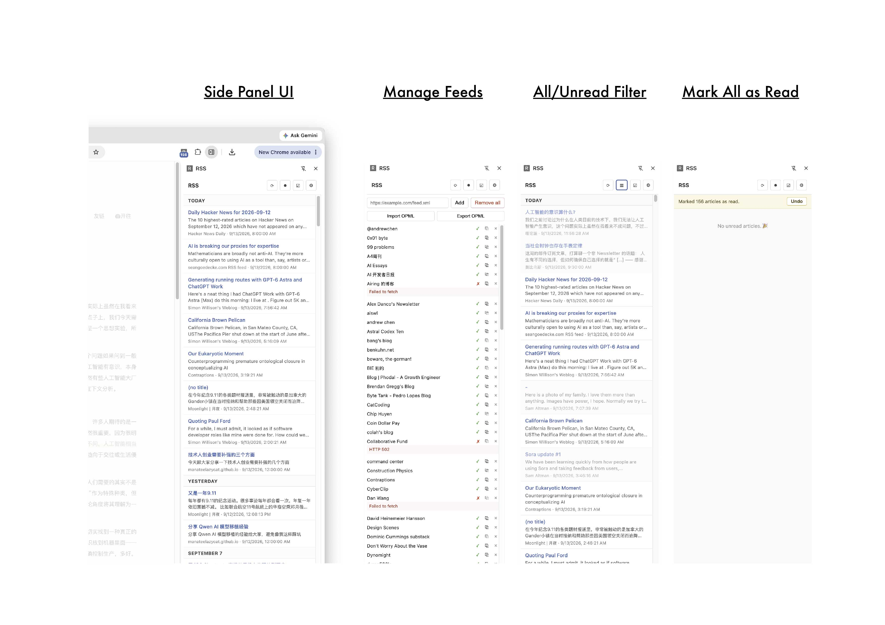

# RSS

> **Note:** Written entirely by AI. Only the demo image is made by myself.

A minimal RSS/Atom reader in the Chrome side panel.

## Features

- Side panel UI — click the toolbar icon to open
- RSS 2.0 and Atom support
- Refreshes in the background every x minutes, plus a manual ⟳ button
- Articles appear as each feed finishes, no waiting for the whole batch
- Read /unread tracking that survives refreshes
- Filter between all posts (`☰`) and unread only (`●`)
- Mark all as read (`☑`) with an 8-second undo
- Date-grouped article list with `Today` / `Yesterday` headers
- Per-feed connection test (`⚡`) with inline error messages
- Copy a feed's URL (`⧉`) with one click
- Add and remove feeds, or remove all subscriptions at once
- OPML import and export
- Unread count badge on the toolbar icon

## Install

1. Open `chrome://extensions` in Chrome (114 or newer).
2. Turn on **Developer mode** (top right).
3. Click **Load unpacked** and select this folder.
4. Click the extension's toolbar icon to open the side panel.

## Usage

- **Add a feed** — click ⚙, paste the feed URL, click **Add**.
- **Test a feed** — click ⚡. Shows ✓ (working) or ✗ with the error.
- **Copy a feed's URL** — click ⧉.
- **Remove a feed** — click × next to it, or **Remove all** in settings.
- **Import /export OPML** — buttons in ⚙ settings.
- **Read an article** — click it. Opens in a new tab and marks it read.
- **Filter unread** — click ☰ / ● in the header.
- **Mark all as read** — click ☑. Click **Undo** in the banner if it was a mistake.

## Files

| File | Purpose |
| ------ | --------- |
| `manifest.json` | Extension manifest. |
| `background.js` | Fetches feeds in the background. |
| `sidepanel.html` | Side panel layout. |
| `sidepanel.css` | Styling. |
| `sidepanel.js` | Side panel behavior. |

## License

Do whatever you want with it.
